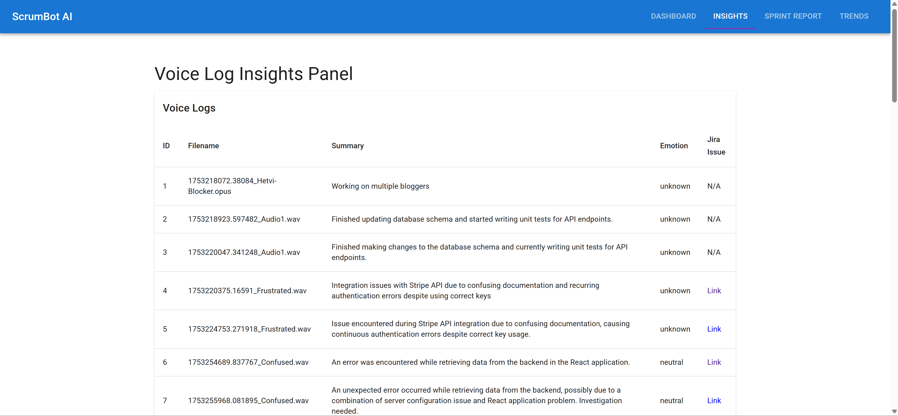
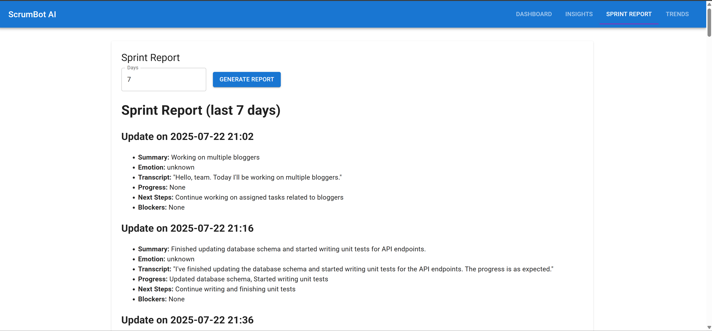

# 🎯 ScrumBot AI – Voice-Driven Sprint Assistant

ScrumBot AI is a full-stack AI-powered sprint assistant that transforms voice memos from developers into structured sprint summaries, Jira issues, and emotional trend dashboards. Designed to optimize daily standups, the tool enables better sprint visibility, proactive risk detection, and real-time team insights.

---

## 🧠 Key Features

- 🎙️ **Voice-based Standups** – Upload voice memos to auto-generate daily updates
- ✍️ **AI-Powered Summarization** – Converts transcripts into concise summaries using Mistral (via Ollama)
- 🔍 **Blocker & Progress Extraction** – Automatically detects blockers, achievements, and requests
- 😊 **Emotion Detection** – Analyzes tone using Hugging Face models to monitor team morale
- 📊 **Trend Visualization** – Interactive dashboards to track blockers, emotions, and sprint velocity
- 🧾 **Jira Integration** – Auto-creates Jira issues from voice insights

---

## ⚙️ Tech Stack

| Layer          | Technology                                      |
|----------------|--------------------------------------------------|
| Frontend       | React, TypeScript, Material UI, Recharts        |
| Backend        | FastAPI, Redis Queue (RQ), Python               |
| AI Models      | Faster-Whisper, Mistral LLM (via Ollama), Hugging Face Transformers |
| Infra/DevOps   | Redis, Docker, GitHub Actions (optional)        |

---

## 🚀 Quick Start

### 🖥️ Backend (FastAPI)

```bash
cd backend
python3 -m venv venv
source venv/bin/activate
pip install -r requirements.txt
uvicorn main:app --reload

🌐 Frontend (React + TypeScript)
cd frontend
npm install
npm start

🧠 Ollama (Mistral LLM)
Install Ollama and pull the Mistral model:

ollama run mistral

🧪 Features in Action
✅ Audio Upload ➝ Transcription ➝ AI Summary ➝ Jira Issue (Optional)
Developer uploads voice memo via UI

Audio is transcribed using Faster-Whisper

Mistral (via Ollama) summarizes progress and flags blockers

Hugging Face detects emotional tone

Summary, emotion, and blocker info stored in Redis

📊 Trends Dashboard
Displays daily blockers, morale trends, and sprint velocity

Uses Recharts to visualize insights based on processed logs


📂 Project Structure

scrumbot-ai/
│
├── backend/
│   ├── main.py
│   ├── models/
│   ├── services/ (ASR, summarization, emotion)
│   ├── tasks/ (RQ jobs)
│   └── ...
│
├── frontend/
│   ├── src/
│   ├── components/
│   ├── pages/
│   └── ...
│
├── README.md
├── .gitignore
└── requirements.txt


🧠 Models Used

| Purpose           | Model                             | Provider       |
| ----------------- | --------------------------------- | -------------- |
| Transcription     | Faster-Whisper                    | OpenAI         |
| Summarization     | Mistral (via Ollama)              | Mistral/Ollama |
| Emotion Detection | `distilbert-base-uncased-emotion` | Hugging Face   |

📸 Screenshots






📘 Future Enhancements
📱 Mobile version with voice recording

🔐 OAuth2 authentication

📦 Docker Compose for deployment


📱 Mobile version with voice recording

🔐 OAuth2 authentication

📦 Docker Compose for deployment

👨‍💻 About the Author
Dev Patel
📍 Windsor, ON
📫 patel7fb@uwindsor.ca
🔗 LinkedIn | GitHub


