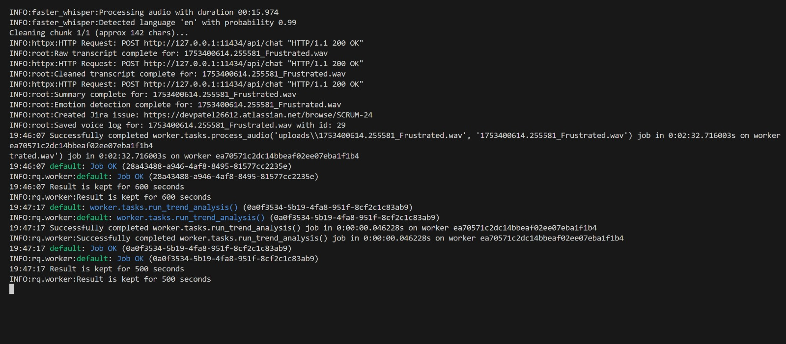

# 🎙️ ScrumBot AI - Voice-Driven Sprint Assistant 🤖

[](https://drive.google.com/file/d/1S8WNUBdXk-2SQB6psX3_LYP44iy90vP3/view?usp=sharing)

**Transform your daily stand-ups with ScrumBot AI, the intelligent sprint assistant that converts developer voice memos into actionable insights!**

ScrumBot AI revolutionizes sprint management by turning voice updates into structured sprint summaries, Jira issues, and insightful emotional trend dashboards. Designed to optimize daily standups, this tool enhances sprint visibility, proactively detects risks, and provides real-time team insights.

---

## 🧠 Key Features

- **🎙️ Voice-Based Standups:** Effortlessly upload voice memos to automatically generate daily updates.
- **✍️ AI-Powered Summarization:** Converts voice transcripts into concise, context-rich summaries using Mistral LLM (via Ollama).
- **🔍 Blocker & Progress Extraction:** Automatically identifies and flags blockers, achievements, and requests from voice updates.
- **😊 Emotion Detection:** Analyzes the emotional tone of voice memos using Hugging Face models to monitor team morale and well-being.
- **📊 Trend Visualization:** Interactive dashboards provide clear visual representations of blockers, emotional trends, and sprint velocity.
- **🧾 Jira Integration:** Seamlessly auto-creates Jira issues directly from voice-derived insights.

---

## ⚙️ Tech Stack

| Layer          | Technology                                      |
|----------------|--------------------------------------------------|
| Frontend       | React, TypeScript, Material UI, Recharts        |
| Backend        | FastAPI, Redis Queue (RQ), Python               |
| AI Models      | Faster-Whisper, Mistral LLM (via Ollama), Hugging Face Transformers |
| Infra/DevOps   | Redis, Docker, GitHub Actions                    |

---

## 🚀 Quick Start

Get ScrumBot AI up and running in a few simple steps:

### 🐳 Docker Setup (Recommended)

1. Make sure [Docker](https://www.docker.com/get-started) and [Docker Compose](https://docs.docker.com/compose/install/) are installed.

2. Create a `.env` file in the `backend` directory with Jira credentials and config:

    ```env
    JIRA_API_URL=https://yourcompany.atlassian.net
    JIRA_EMAIL=your_email@company.com
    JIRA_API_TOKEN=your_jira_token
    JIRA_PROJECT_KEY=ABC
    ```

3. Run the app stack:

    ```bash
    docker-compose up --build
    ```

    This will launch:
    - Redis server on port 6380
    - FastAPI backend on port 8000
    - React frontend on port 3000
    - RQ worker for async task processing

4. Visit [http://localhost:3000](http://localhost:3000) in your browser.

---

### 🖥️ Backend (FastAPI) - Manual Setup

1. Navigate to the backend directory:

    ```bash
    cd backend
    ```

2. Create and activate a Python virtual environment:

    ```bash
    python3 -m venv venv
    source venv/bin/activate
    ```

3. Install dependencies:

    ```bash
    pip install -r requirements.txt
    ```

4. Start a Redis server (locally or via Docker):

    ```bash
    docker run -p 6380:6379 redis
    ```

5. Run the RQ worker in a separate terminal (must point to Redis on port 6380):

    ```bash
    rq worker --worker-class rq.worker.SimpleWorker --url redis://localhost:6380
    ```

6. Launch FastAPI backend:

    ```bash
    uvicorn main:app --reload
    ```

---

### 🌐 Frontend (React + TypeScript)

1. Navigate to the frontend directory:

    ```bash
    cd frontend
    ```

2. Install npm packages:

    ```bash
    npm install
    ```

3. Start the React application:

    ```bash
    npm start
    ```

---

### 🧠 Ollama (Mistral LLM)

1. Install [Ollama](https://ollama.com/).

2. Pull and run the Mistral model:

    ```bash
    ollama run mistral
    ```

---

### 🧪 Features in Action

1. **Audio Upload ➝ Transcription ➝ AI Summary ➝ Jira Issue (Optional)**
    - Upload voice memos via the UI.
    - Audio is transcribed with Faster-Whisper.
    - Mistral (via Ollama) summarizes progress and flags blockers.
    - Hugging Face detects emotional tone.
    - Summaries, emotions, and blocker info stored in Redis.
    - Jira issues auto-created for blockers using configured Jira API.

---

### 📊 Trends Dashboard

* Displays daily blockers, morale trends, and sprint velocity using Recharts based on processed logs.

---

## 🧠 Models Used

| Purpose           | Model                             | Provider       |
| ----------------- | --------------------------------- | -------------- |
| Transcription     | Faster-Whisper                    | OpenAI         |
| Summarization     | Mistral (via Ollama)              | Mistral/Ollama |
| Emotion Detection | `distilbert-base-uncased-emotion` | Hugging Face   |

---

## 📸 Screenshots

### 📊 Dashboard  


### 📈 Trends  


### 📝 Log Details  


### 📄 Sprint Report  


### ⚙️ Backend Architecture  


---

## 📘 Future Enhancements

- 📱 Mobile version with voice recording capabilities
- 🔐 OAuth2 authentication for enhanced security
- 📦 Docker Compose improvements for simplified one-command deployment

---

## 👨‍💻 About the Author

**Dev Patel**  
📍 Windsor, ON  
📫 [patel7fb@uwindsor.ca](mailto:patel7fb@uwindsor.ca)  
🔗 [LinkedIn](https://www.linkedin.com/in/dev-patel-561535200/) | [GitHub](https://github.com/devpatel2601)
