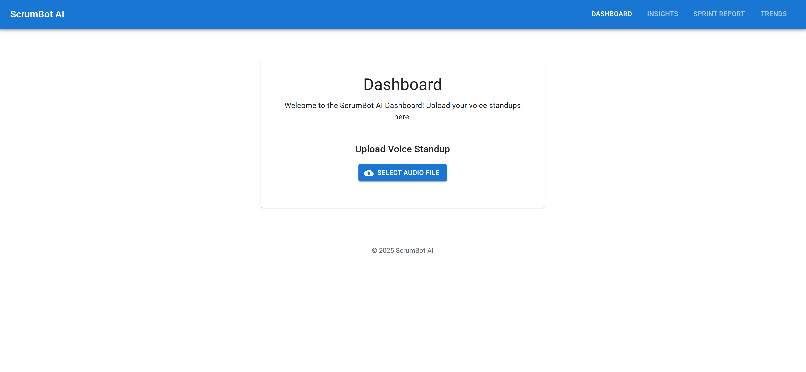
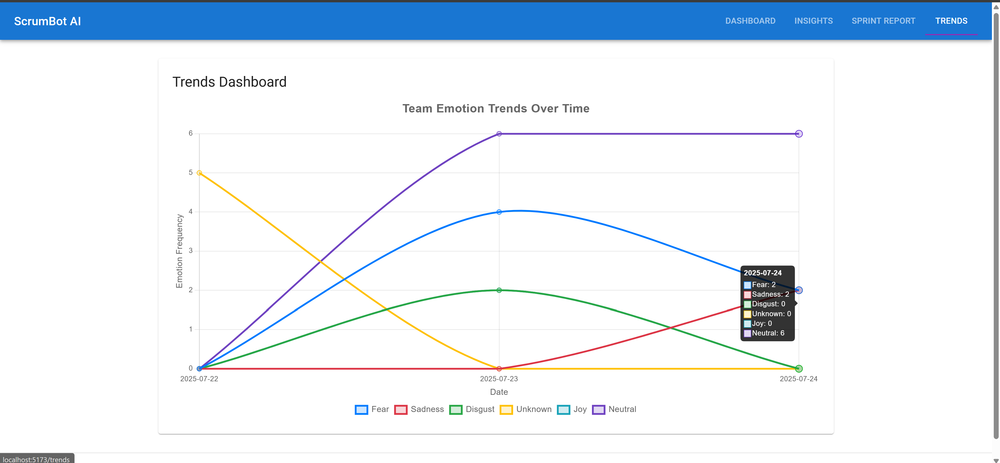
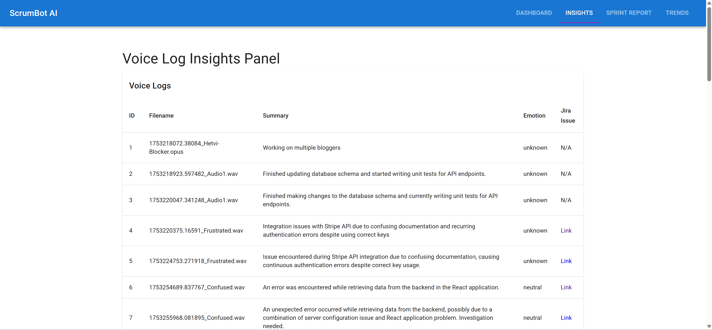
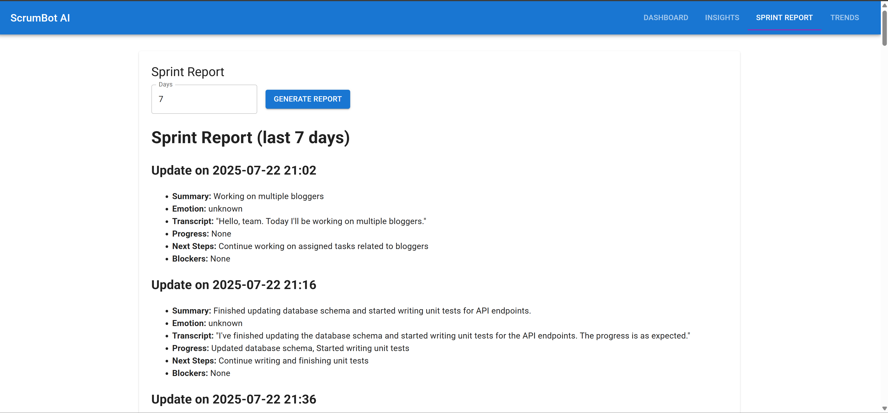

# 🎙️ ScrumBot AI - Voice-Driven Sprint Assistant 🤖

**Transform your daily stand-ups with ScrumBot AI, the intelligent sprint assistant that converts developer voice memos into actionable insights!**

ScrumBot AI revolutionizes sprint management by turning voice updates into structured sprint summaries, Jira issues, and insightful emotional trend dashboards. Designed to optimize daily standups, this tool enhances sprint visibility, proactively detects risks, and provides real-time team insights.

---

## 🧠 Key Features

- **🎙️ Voice-Based Standups:** Effortlessly upload voice memos to automatically generate daily updates.
- **✍️ AI-Powered Summarization:** Converts voice transcripts into concise, context-rich summaries using Mistral LLM (via Ollama).
- **🔍 Blocker & Progress Extraction:** Automatically identifies and flags blockers, achievements, and requests from voice updates.
- **😊 Emotion Detection:** Analyzes the emotional tone of voice memos using Hugging Face models to monitor team morale and well-being.
- **📊 Trend Visualization:** Interactive dashboards provide clear visual representations of blockers, emotional trends, and sprint velocity.
- **🧾 Jira Integration:** Seamlessly auto-creates Jira issues directly from voice-derived insights.

---

## ⚙️ Tech Stack

| Layer          | Technology                                      |
|----------------|--------------------------------------------------|
| Frontend       | React, TypeScript, Material UI, Recharts        |
| Backend        | FastAPI, Redis Queue (RQ), Python               |
| AI Models      | Faster-Whisper, Mistral LLM (via Ollama), Hugging Face Transformers |
| Infra/DevOps   | Redis, Docker, GitHub Actions (optional)        |

---

## 🚀 Quick Start

Get ScrumBot AI up and running in a few simple steps:

### 🖥️ Backend (FastAPI)

1.  Navigate to the backend directory:

    ```bash
    cd backend
    ```
2.  Create a virtual environment:

    ```bash
    python3 -m venv venv
    ```
3.  Activate the virtual environment:

    ```bash
    source venv/bin/activate
    ```
4.  Install the required Python packages:

    ```bash
    pip install -r requirements.txt
    ```
5.  Run the FastAPI application:

    ```bash
    uvicorn main:app --reload
    ```

### 🌐 Frontend (React + TypeScript)

1.  Navigate to the frontend directory:

    ```bash
    cd frontend
    ```
2.  Install the npm packages:

    ```bash
    npm install
    ```
3.  Start the React application:

    ```bash
    npm start
    ```

### 🧠 Ollama (Mistral LLM)

1.  Install [Ollama](https://ollama.com/).
2.  Pull the Mistral model:

    ```bash
    ollama run mistral
    ```

### 🧪 Features in Action

1.  **Audio Upload ➝ Transcription ➝ AI Summary ➝ Jira Issue (Optional)**
    *   A developer uploads a voice memo via the UI.
    *   The audio is transcribed using Faster-Whisper.
    *   Mistral (via Ollama) summarizes progress and flags blockers.
    *   Hugging Face detects the emotional tone.
    *   The summary, emotion, and blocker information are stored in Redis.

### 📊 Trends Dashboard

*   Displays daily blockers, morale trends, and sprint velocity using Recharts to visualize insights from the processed logs.

---


---

## 🧠 Models Used

| Purpose           | Model                             | Provider       |
| ----------------- | --------------------------------- | -------------- |
| Transcription     | Faster-Whisper                    | OpenAI         |
| Summarization     | Mistral (via Ollama)              | Mistral/Ollama |
| Emotion Detection | `distilbert-base-uncased-emotion` | Hugging Face   |

---

## 📸 Screenshots

### 📊 Dashboard


### 📈 Trends


### 📝 Log Details


### 📄 Sprint Report


### ⚙️ Backend Architecture


---

## 📘 Future Enhancements

- 📱 Mobile version with voice recording capabilities
- 🔐 OAuth2 authentication for enhanced security
- 📦 Docker Compose for streamlined deployment

---

## 👨‍💻 About the Author

**Dev Patel**

📍 Windsor, ON

📫 [patel7fb@uwindsor.ca](mailto:patel7fb@uwindsor.ca)

🔗 [LinkedIn](https://www.linkedin.com/in/dev-patel-561535200/) | [GitHub](https://github.com/devpatel2601)